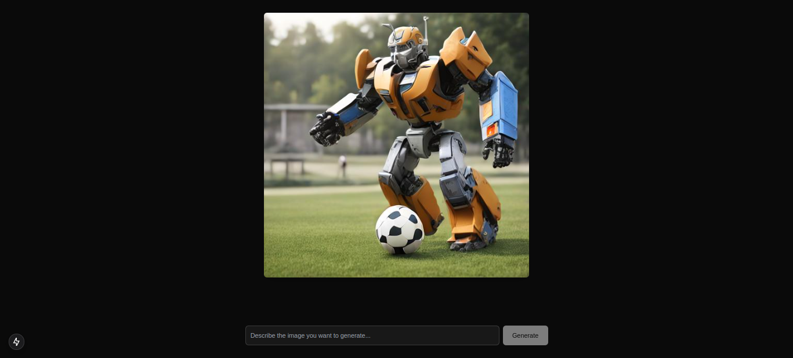
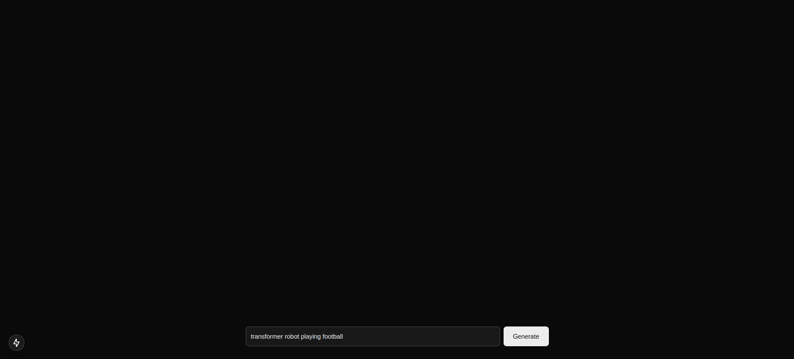

# Pentagram: Realtime Image Diffusion

## Getting Started

First, clone the GitHub repository:

```bash
git clone https://github.com/tushcmd/pentagram.git
```

Then, navigate to the project directory:

```bash
cd pentagram
```

Then, install the dependencies:

```bash
npm install
```

Copy `.env.example` into `.env.local` replace with you api keys

Run the development server:

```bash
npm run dev
```

Open [http://localhost:3000](http://localhost:3000) with your browser to see the result.

The urls called are created in this repo:
<https://github.com/tushcmd/pentagram-image-diffusion.git>

## Screenshot




Demo video:

## Features to add

- 1
- 2
